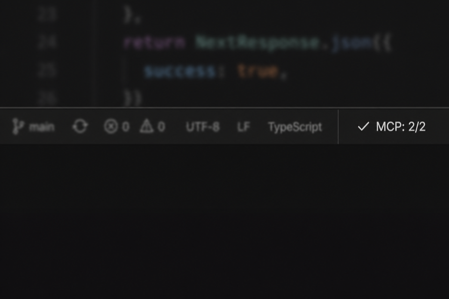
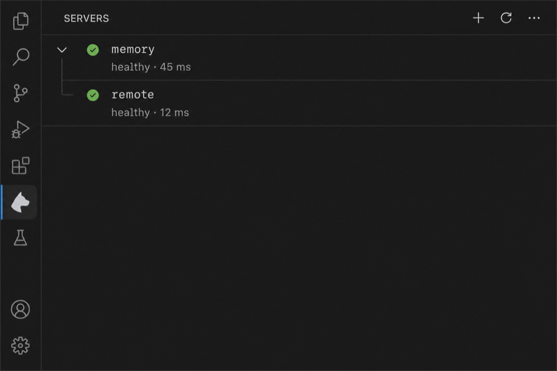

# MCP Watchdog

[](https://github.com/vaibhav11123/mcp-watchdog/actions/workflows/ci.yml)
[](https://github.com/vaibhav11123/mcp-watchdog/releases)
[](./LICENSE)
[](https://marketplace.visualstudio.com/items?itemName=mcp-watchdog.mcp-watchdog)

**Repository:** [github.com/vaibhav11123/mcp-watchdog](https://github.com/vaibhav11123/mcp-watchdog)

VS Code / Cursor extension that runs a **parallel health layer** over MCP servers from your MCP config files: periodic pings, exponential backoff reconnects, and an extra check when the window regains focus (helpful after sleep).

**This does not replace** the editor’s built-in MCP integration. It opens **its own** MCP client connections **only to monitor** reachability and latency.

## Install

| Channel | Steps |
|--------|--------|
| **Marketplace** | Search **“MCP Watchdog”** or open **[MCP Watchdog on Visual Studio Marketplace](https://marketplace.visualstudio.com/items?itemName=mcp-watchdog.mcp-watchdog)** (`mcp-watchdog.mcp-watchdog`). |
| **VSIX** | **[Releases](https://github.com/vaibhav11123/mcp-watchdog/releases)** → download the latest `.vsix`, then **Extensions** → **⋯** → **Install from VSIX…**, or run `cursor --install-extension ./mcp-watchdog-0.x.x.vsix` (or `code --install-extension …`). |

After install, **reload** the window if commands or views do not appear.

## Requirements

- **VS Code** or **Cursor** with a compatible engine: this manifest declares **`engines.vscode`: `^1.105.0`** (adjust if you need a different floor after testing).
- A **workspace folder** open in the editor.
- MCP config in at least one of:
  - **`.vscode/mcp.json`** — VS Code (`servers` object)
  - **`.cursor/mcp.json`** — Cursor (`mcpServers` or `servers`)
  - **`~/.cursor/mcp.json`** — Cursor global (merged with project config)
- In **multi-root** workspaces, only the **first** folder is used when resolving paths and **`${workspaceFolder}`**.

## Where is the UI?

VS Code has **two different sidebars**:

| Place | What you see |
|--------|----------------|
| **Extensions** (puzzle piece) → click **MCP Watchdog** | Marketplace **README** only—the same for almost every extension. This is **not** the live dashboard. |
| **Activity bar** → **MCP Watchdog** icon | **Overview** dashboard (metrics + actions) and **Servers** tree (per-server detail). This is the real UI. |

Other extensions that “show UI when opened” usually either (1) open their **own activity bar panel** (GitLens, Docker, etc.), (2) add a **Getting Started walkthrough** (first install), or (3) use a **webview** in the sidebar. MCP Watchdog uses (1) + a walkthrough on first install.

After install, run **Help → Welcome → MCP Watchdog: Get started** (walkthrough), or **MCP Watchdog: Open Servers View**.

## Quick start

1. Add MCP config (see examples below). Command: **MCP Watchdog: Open MCP Config**.
2. Open that folder. Click the **MCP Watchdog** icon in the **activity bar** → **Servers** (not the Extensions panel). The **status bar** shows **`MCP: n/n`** when servers are monitored.
3. Optional: **View → Output → MCP Watchdog** for detailed logs.

## Screenshots

**Status bar** — aggregate health (`MCP: healthy / total`) on the bottom right:



**Servers** view — per-server state and last ping latency in the MCP Watchdog activity bar sidebar:


### Example `mcp.json`

```json
{
  "servers": {
    "memory": {
      "type": "stdio",
      "command": "npx",
      "args": ["-y", "@modelcontextprotocol/server-memory"]
    },
    "remote": {
      "type": "http",
      "url": "http://localhost:3000/mcp",
      "headers": { "Authorization": "Bearer YOUR_TOKEN" }
    }
  }
}
```

**Security:** only configure servers you trust. This extension runs **`command`** (e.g. `npx`, `node`) and opens **HTTP(S)** URLs you specify.

## Commands

- **MCP Watchdog: Show Server Status** — Quick pick with per-server state.
- **MCP Watchdog: Reconnect All Servers**
- **MCP Watchdog: Reconnect Server…**
- **MCP Watchdog: Open Servers View** — Focus the **Servers** tree.
- **MCP Watchdog: Open MCP Config** — Open or create `.cursor/mcp.json` / `.vscode/mcp.json`.

## Settings (`mcpWatchdog.*`)

| Setting | Default | Description |
|---------|---------|-------------|
| `pingIntervalMs` | `30000` | Ping cadence (ms). |
| `maxRetries` | `5` | Max reconnect attempts before marking failed. |
| `initialBackoffMs` | `1000` | First backoff after failure (ms). |
| `backoffMultiplier` | `1.5` | Backoff multiplier. |
| `maxBackoffMs` | `30000` | Backoff cap (ms). |

Changes apply on **reload** or when **`mcp.json`** is reloaded; live settings refresh without reload is not implemented yet.

## Privacy & data

- **No** bundled analytics or telemetry from this extension.
- Traffic goes to **your configured** MCP servers only (stdio child processes and HTTP clients you define in `mcp.json`).
- Do **not** commit secrets inside `mcp.json` in shared repos; use environment variables or secret stores appropriate to your team.

## Known limitations

- Reads **`.vscode/mcp.json`**, **`.cursor/mcp.json`**, and **`~/.cursor/mcp.json`** (merged; project files override global). Does not read other user-global VS Code MCP paths yet.
- **Independent of the editor’s MCP UI**: native MCP may show different state until the next Watchdog ping.
- **HTTP transport** may combine SDK-level reconnection with Watchdog-level retries.
- **Malformed `mcp.json`**: invalid JSON shows an error notification; fix the file and save.

## Troubleshooting

| Symptom | What to check |
|---------|----------------|
| **Servers** view is empty | Open a **folder** (not just a file). Add **`.cursor/mcp.json`** (Cursor) or **`.vscode/mcp.json`** (VS Code). Use the **activity bar** MCP Watchdog icon, not the Extensions detail page. |
| No **MCP Watchdog** in Output / no status | Folder open? MCP config present? Try **Developer: Show Running Extensions** → **MCP Watchdog** activated. |
| **No servers** / **0/n** | `servers` key missing or empty; path is wrong root in multi-root. |
| **Connecting** forever | `npx`/network blocked; stdio command wrong; HTTP URL/firewall. |
| `Ping failed: Not connected` then retry | Expected after killing a server or network blip; Watchdog should reconnect within your backoff settings. |

See **Screenshots** above for the Marketplace / README visuals.

## Development

```bash
npm install
npm run compile
npm run build
```

- **Run Extension** / **Run Extension (mcp-watchdog-test workspace)** from `.vscode/launch.json`.
- Fixture: `mcp-watchdog-test/` (optional; not shipped in VSIX).
- Headless smoke: `npm run smoke`.

See [CHANGELOG.md](./CHANGELOG.md).

## Ship checklist (maintainers)

1. **`publisher`** — Currently **`mcp-watchdog`**; change in `package.json` if you use a different [Marketplace publisher](https://marketplace.visualstudio.com/manage) id.
2. **`repository` / `bugs` / `homepage`** — Update in `package.json` if you publish under a different GitHub org or repo name.
3. **`version`** — Bump per semver; summarize in `CHANGELOG.md`.
4. **README** — Screenshots, confirm engine range matches lowest editor you support.
5. **Publish** — `npx @vscode/vsce login <publisher>` then `npx @vscode/vsce publish` (after `npm run build`).

```bash
npm run build
npx @vscode/vsce package
# install locally to verify
cursor --install-extension mcp-watchdog-<version>.vsix
```

## License

MIT — see [LICENSE](./LICENSE).

Security: see [SECURITY.md](./SECURITY.md).
