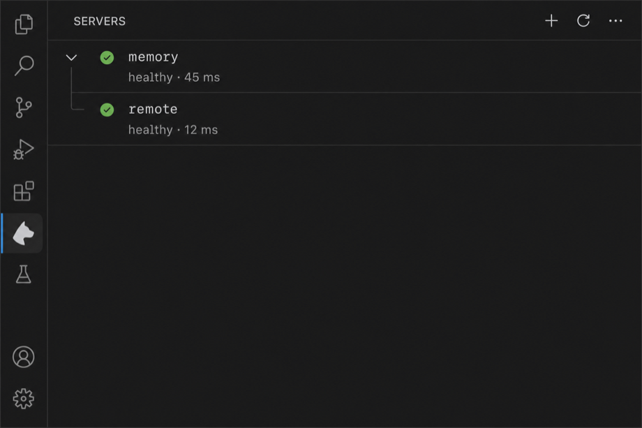
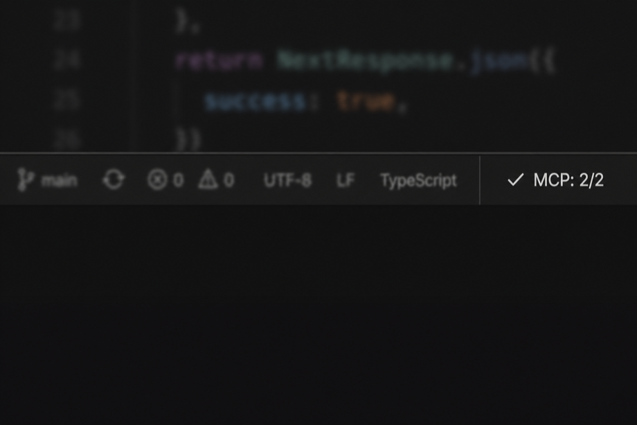

# MCP Watchdog

[](https://github.com/vaibhav11123/mcp-watchdog/actions/workflows/ci.yml)
[](https://github.com/vaibhav11123/mcp-watchdog/releases)
[](./LICENSE)
[](https://open-vsx.org/extension/mcp-watchdog/mcp-watchdog)
[](https://marketplace.visualstudio.com/items?itemName=mcp-watchdog.mcp-watchdog)

**Repository:** [github.com/vaibhav11123/mcp-watchdog](https://github.com/vaibhav11123/mcp-watchdog)

## Why

**Your editor drops MCP servers silently.** After sleep, a flaky `npx` child, or a network blip, Cursor and VS Code often keep showing tools as available while the underlying MCP connection is dead. You only notice when a tool call fails mid-task.

**MCP Watchdog** is a parallel health layer: it probes your configured servers on a schedule, shows **`MCP: healthy/total`** in the status bar, **notifies you when something fails**, and offers **one-click Reconnect** (or **Reload Window** when the editor’s own MCP client is stuck).

**Honest scope:** this does **not** replace the editor’s built-in MCP integration. Watchdog opens its **own** read-only health connections to measure reachability and latency — it cannot fix editor-internal MCP state without you reloading.

Works in **Cursor**, **Windsurf**, **VS Code**, **VSCodium**, and other forks that install from [Open VSX](https://open-vsx.org/).

## Demo

<!-- GIF shot list (record → save as images/demo.gif, ~15s):
  1. Activity bar → MCP Watchdog → Overview, status bar MCP: 1/1 healthy
  2. Terminal: pkill -f server-memory (or your MCP server)
  3. Toast: "MCP server … failed" with Reconnect / Reload Window
  4. Click Reconnect → healthy again
-->



*Replace with `images/demo.gif` when recorded (15s: kill server → failure toast → Reconnect → healthy).*

## Install

### Install in Cursor (recommended)

Most Cursor installs pull extensions from **Open VSX**, not the VS Marketplace:

1. **Extensions** (`Cmd+Shift+X`) → search **`MCP Watchdog`**
2. Or open **[MCP Watchdog on Open VSX](https://open-vsx.org/extension/mcp-watchdog/mcp-watchdog)** → **Download** / install from the registry
3. Or CLI: `cursor --install-extension mcp-watchdog.mcp-watchdog`

### All install channels

| Channel | Who | How |
|--------|-----|-----|
| **[Open VSX](https://open-vsx.org/extension/mcp-watchdog/mcp-watchdog)** | **Cursor, Windsurf, VSCodium, Trae**, most VS Code forks | Extensions search, or link above |
| **[VS Marketplace](https://marketplace.visualstudio.com/items?itemName=mcp-watchdog.mcp-watchdog)** | VS Code (Microsoft build) | Extensions search → `mcp-watchdog.mcp-watchdog` |
| **[GitHub Releases](https://github.com/vaibhav11123/mcp-watchdog/releases)** | Airgapped / manual | Download `.vsix` → **Install from VSIX…**, or `cursor --install-extension mcp-watchdog-0.2.0.vsix` |

After install, **reload** the window. Open the **activity bar** MCP Watchdog icon (not the Extensions detail page).

## Requirements

- **VS Code** or **Cursor** with a compatible engine: this manifest declares **`engines.vscode`: `^1.105.0`** (adjust if you need a different floor after testing).
- A **workspace folder** open in the editor.
- MCP config in at least one of:
  - **`.vscode/mcp.json`** — VS Code (`servers` object)
  - **`.cursor/mcp.json`** — Cursor (`mcpServers` or `servers`)
  - **`~/.cursor/mcp.json`** — Cursor global (merged with project config)
- In **multi-root** workspaces, only the **first** folder is used when resolving paths and **`${workspaceFolder}`**.

## Where is the UI?

VS Code has **two different sidebars**:

| Place | What you see |
|--------|----------------|
| **Extensions** (puzzle piece) → click **MCP Watchdog** | Marketplace **README** only—the same for almost every extension. This is **not** the live dashboard. |
| **Activity bar** → **MCP Watchdog** icon | **Overview** dashboard (metrics + actions) and **Servers** tree (per-server detail). This is the real UI. |

Other extensions that “show UI when opened” usually either (1) open their **own activity bar panel** (GitLens, Docker, etc.), (2) add a **Getting Started walkthrough** (first install), or (3) use a **webview** in the sidebar. MCP Watchdog uses (1) + a walkthrough on first install.

After install, run **Help → Welcome → MCP Watchdog: Get started** (walkthrough), or **MCP Watchdog: Open Servers View**.

## Quick start

1. Add MCP config (see examples below). Command: **MCP Watchdog: Open MCP Config**.
2. Open that folder. Click the **MCP Watchdog** icon in the **activity bar** → **Servers** (not the Extensions panel). The **status bar** shows **`MCP: n/n`** when servers are monitored.
3. Optional: **View → Output → MCP Watchdog** for detailed logs.

## Screenshots

**Status bar** — aggregate health (`MCP: healthy / total`) on the bottom right:



**Servers** view — per-server state and last ping latency in the MCP Watchdog activity bar sidebar:


### Example `mcp.json`

```json
{
  "servers": {
    "memory": {
      "type": "stdio",
      "command": "npx",
      "args": ["-y", "@modelcontextprotocol/server-memory"]
    },
    "remote": {
      "type": "http",
      "url": "http://localhost:3000/mcp",
      "headers": { "Authorization": "Bearer YOUR_TOKEN" }
    }
  }
}
```

**Security:** only configure servers you trust. This extension runs **`command`** (e.g. `npx`, `node`) and opens **HTTP(S)** URLs you specify.

### Trust & consent

By default (**`mcpWatchdog.requireApproval`**: `true`), Watchdog **does not** spawn stdio processes or open HTTP connections until you approve. On first load (or after `mcp.json` changes), you get a notification with **Review & Allow** / **Not now**. **Review & Allow** opens a multi-select list of every server (`name — command args` or `name — url`); only the subset you confirm is monitored. Approval is stored per workspace folder and survives reloads. Changing a command, arg, or URL in config re-prompts. **Not now** leaves the status bar at `$(shield) MCP: untrusted` — click it to review again. Set **`requireApproval`** to `false` on a trusted single-user machine to auto-connect like 0.1.x.

## Commands

- **MCP Watchdog: Show Server Status** — Quick pick with per-server state.
- **MCP Watchdog: Review Trusted Servers** — Change the approved subset or revoke trust.
- **MCP Watchdog: Reconnect All Servers**
- **MCP Watchdog: Reconnect Server…**
- **MCP Watchdog: Open Servers View** — Focus the **Servers** tree.
- **MCP Watchdog: Open MCP Config** — Open or create `.cursor/mcp.json` / `.vscode/mcp.json`.

## Settings (`mcpWatchdog.*`)

| Setting | Default | Description |
|---------|---------|-------------|
| `pingIntervalMs` | `30000` | Ping cadence (ms). |
| `maxRetries` | `5` | Max reconnect attempts before marking failed. |
| `initialBackoffMs` | `1000` | First backoff after failure (ms). |
| `backoffMultiplier` | `1.5` | Backoff multiplier. |
| `maxBackoffMs` | `30000` | Backoff cap (ms). |
| `requireApproval` | `true` | Prompt before connecting to configured MCP servers. |
| `probeMode` | `interval` | `interval` = connect/ping/close each cycle; `persistent` = long-lived client (0.1.x behavior). |
| `perServer` | `{}` | Per-server `probeMode`, `pingIntervalMs`, `enabled` overrides. |
| `pingTimeoutMs` | `5000` | Ping/probe timeout (ms). |
| `notify` | `failures` | Toasts: `failures` (default), `all` (+ recovery), `none`. |
| `degradedAlertDelayMs` | `60000` | Wait before warning toast on sustained degraded state. |

### Alerts

When a server fails, Watchdog shows a notification with **Reconnect**, **Show Log**, **Reload Window**, and **Mute 1h**. Set `mcpWatchdog.notify` to `all` to also get recovery toasts. Repeated failures within 10 minutes collapse into a single **flapping** warning.

### Probe modes

| Mode | Behavior | When to use |
|------|----------|-------------|
| **interval** (default) | Each cycle connects, pings, then closes — no duplicate stdio process between checks. | Most servers; avoids leaving extra `npx` children running. |
| **persistent** | Keeps one MCP client open and pings on an interval. | Stateful servers that lose session state on disconnect (use deliberately). |

Settings changes apply within ~1s without reloading the window; **`mcp.json`** edits reload monitors via the file watcher.

## Privacy & data

- **No** bundled analytics or telemetry from this extension.
- Traffic goes to **your configured** MCP servers only (stdio child processes and HTTP clients you define in `mcp.json`).
- Do **not** commit secrets inside `mcp.json` in shared repos; use environment variables or secret stores appropriate to your team.

## Known limitations

- Reads **`.vscode/mcp.json`**, **`.cursor/mcp.json`**, and **`~/.cursor/mcp.json`** (merged; project files override global). Does not read other user-global VS Code MCP paths yet.
- **Independent of the editor’s MCP UI**: native MCP may show different state until the next Watchdog ping.
- **HTTP transport** may combine SDK-level reconnection with Watchdog-level retries.
- **Malformed `mcp.json`**: invalid JSON shows an error notification; fix the file and save.

## Troubleshooting

| Symptom | What to check |
|---------|----------------|
| **Servers** view is empty | Open a **folder** (not just a file). Add **`.cursor/mcp.json`** (Cursor) or **`.vscode/mcp.json`** (VS Code). Use the **activity bar** MCP Watchdog icon, not the Extensions detail page. |
| No **MCP Watchdog** in Output / no status | Folder open? MCP config present? Try **Developer: Show Running Extensions** → **MCP Watchdog** activated. |
| **No servers** / **0/n** | `servers` key missing or empty; path is wrong root in multi-root. |
| **Connecting** forever | `npx`/network blocked; stdio command wrong; HTTP URL/firewall. |
| `Ping failed: Not connected` then retry | Expected after killing a server or network blip; Watchdog should reconnect within your backoff settings. |

See **Screenshots** above for the Marketplace / README visuals.

## Development

```bash
npm install
npm run compile
npm run build
```

- **Run Extension** / **Run Extension (mcp-watchdog-test workspace)** from `.vscode/launch.json`.
- Fixture: `mcp-watchdog-test/` (optional; not shipped in VSIX).
- Headless smoke: `npm run smoke`.

See [CHANGELOG.md](./CHANGELOG.md).

## Ship checklist (maintainers)

1. Record **`images/demo.gif`** (see HTML comment in README Demo section).
2. `npm test` && `npx vsce package` — confirm `vsce ls` has no `test/`, `*.local.md`.
3. Set GitHub secrets: **`VSCE_PAT`**, **`OVSX_PAT`** (see [CONTRIBUTING.md](./CONTRIBUTING.md)).
4. `./scripts/ship-release.sh` or push tag `v*` to run [release.yml](./.github/workflows/release.yml).

```bash
export VSCE_PAT=... OVSX_PAT=...   # one-time
./scripts/ship-release.sh
```

## License

MIT — see [LICENSE](./LICENSE).

Security: see [SECURITY.md](./SECURITY.md).
